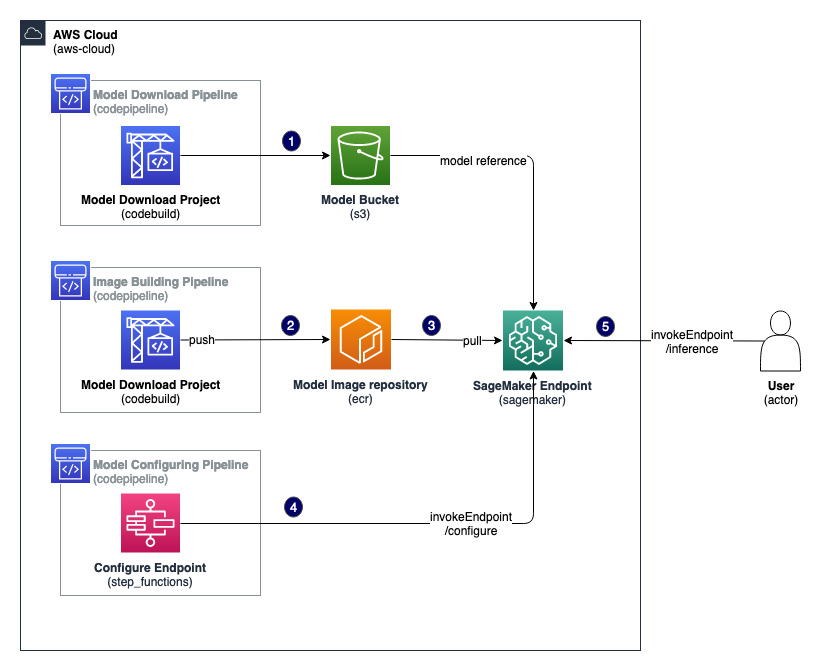

# Large Language Models (LLMs) on CPU as SageMaker Endpoints

This code demonstrates how you can run Large Language Models (LLMs) on CPU-only instances including Graviton. We are using [Llama.cpp project](https://github.com/ggerganov/llama.cpp) and exposing an Sagemaker endpoint API for inference. Models are downloaded from [Hugging Face model hub](https://huggingface.co/models).
The project can be deployed to be compatible to both ARM64 and x86 architectures. 

## Project Overview

This project is built by using [AWS Cloud Development Kit](https://aws.amazon.com/cdk/)(AWS CDK)  with Python.
The `cdk.json` file tells the CDK Toolkit how to execute your app.

### Configuration

AWS CDK app configuration file values are in `config.yaml`:

| Parameter | Description | Example value | 
| :---    | :---    | :---    |
| project.name | Used as prefix for AWS resources created with this app | cpu-llm |
| model.hf_name | [HuggingFace](https://huggingface.co) model name | TheBloke/Llama-2-7b-Chat-GGUF |
| model.full_name | [HuggingFace](https://huggingface.co) model file full name | llama-2-7b-chat.Q4_K_M.gguf |
| image.platform | Platfrom used to run inference and build an image; Values: ["ARM", "AMD"]  | ARM |
| image.image_tag | Tag used to tag the image; | arm-latest |
| inference.sagemaker_model_name | SageMaker endpoint name for model inference | llama-2-7b-chat |
| inference.instance_type | Instance type used for SageMaker Endpoint | "ml.c7g.8xlarge" for ARM platform or "ml.g5.xlarge" for AMD platform |

At the moment the only supported options are ARM-based inference on Amazon Graviton processors and AMD-based inference for CUDA-based GPUs (G5 are highly recommended). For GPU inference we do not support weights sharding across multiple GPU cards.  

### Architecture



The stack can be found in `./infrastructure` directory.

## Prerequisites

Before proceeding any further, you need to identify and designate an AWS account required for the solution to work. 

### Deploying from your local machine

You need to create an AWS account profile in ~/.aws/credentials for the designated AWS account, if you don’t already have one. The profile needs to have sufficient permissions to run an [AWS Cloud Development Kit](https://aws.amazon.com/cdk/) (AWS CDK) stack. We recommend removing the profile when you’re finished with the testing. For more information about creating an AWS account profile, see [Configuring the AWS CLI](https://docs.aws.amazon.com/cli/latest/userguide/cli-chap-configure.html). 

Python 3.11.x or later has to be installed on a machine to run CDK code. 
You will also need to install AWS CDK CLI as per [documentation](https://docs.aws.amazon.com/cdk/v2/guide/getting_started.html) and [bootstrap](https://docs.aws.amazon.com/cdk/v2/guide/bootstrapping.html) your environment.  


### Deploying from Cloud9 instance

If you don't want to install the necessary software locally you can spin up [Cloud9](https://docs.aws.amazon.com/cloud9/latest/user-guide/create-environment-main.html) instance that already have all necessary software preinstalled, however if this is your first CDK deployment in the account and/or region you will need to [bootstrap](https://docs.aws.amazon.com/cdk/v2/guide/bootstrapping.html) your environment. 

## CDK deployment 
### To Create Resources / Deploy Stack

Open the terminal and run the following commands:

```bash
# uncomment the line below if you need to bootstrap your environment
# replace ACCOUNT_ID and REGION placeholders with your actual
# AWS account id and region where you deploy the application

# cdk bootstrap aws://ACCOUNT_ID/REGION 

git clone https://github.com/aws-samples/genai-llm-cpu-sagemaker llamacpp
cd llamacpp
python3 -m venv .venv
source .venv/bin/activate
pip3 install -r requirements.txt
cdk deploy
```

### To Destroy Resources / Clean-up

Delete stack from Cloudfromation console.

### Model Selection / Change

Only changing a model does not require rebuidling an image, and would take approximatelly 30% less time than redeploying the whole application. You can use the following process:

1. Navigate to https://huggingface.co/TheBloke and choose GGUF model of your choice for example https://huggingface.co/TheBloke/llama-2-7B-Arguments-GGUF, scroll to provided files. Usually Q4_K_M is good enough compromise (based on our testing but feel free to try yourself).

2. Update values of the variables in `config.yaml` to use the new model:
    * model.hf_name - set Hugging Face model name e.g. "TheBloke/llama-2-7B-Arguments-GGUF"
    * model.full_name - set Hugging Face file full name e.g. "llama-2-7b-chat.Q4_K_M.gguf"

3. Re-deploy stack by running `cdk deploy`

### Platform Selection / Change

1. Update values of the variables in `config.yaml` to use the different platform:
    * platform      - set platform (not case sensitive) e.g. "AMD"
    * instance_type - set instance type that matches platform e.g. "ml.g5.xlarge"
    * image_tag     - (optional) update image tag e.g. "amd-latest"

2. Re-deploy stack by running `cdk deploy` 


## Multi-Model Deployment

Sometimes you want to try multiple models from Hugging face to compare the quality of responses or latency. For this you can specify several models in `multimodel_config.yaml` and then use provided python script to start multiple model deployments in parallel.

```bash
python3 multimodel_cdk.py --deploy
```

## Inference

Use `notebooks/inference.ipynb` as an example. IAM credentials / IAM Role that you use to run the notebook has to allow `sagemaker:InvokeEndpoint` API calls. 

If you don't have an existing environment to run Juputer notebooks, the easiest way to run the notebook would be to create new Sagemaker [notebook instance](https://docs.aws.amazon.com/sagemaker/latest/dg/howitworks-create-ws.html) using default settings and letting Sagemaker to create the necessary IAM role with enough permissions to interact with provisioned LLM endpoint. 

### Credits

Built based on Sean Bradley's project that was modified to work with SageMaker endpoints.

## Security

See [CONTRIBUTING](CONTRIBUTING.md#security-issue-notifications)  for more information.

## License

This library is licensed under the MIT-0 License. See the LICENSE file.
